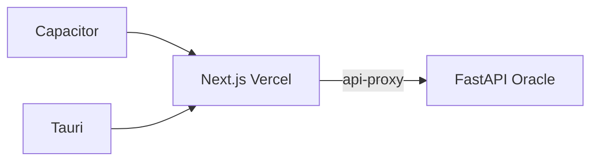

# Apps natives — mobile + desktop

Même UI que le site Next.js ([`frontend/web`](web/)). Les coquilles chargent l’URL de production ; le design et l’API (`/api-proxy`) restent côté Vercel.

| Plateforme | Dossier | Techno |
|---|---|---|
| iOS + Android | [`frontend/mobile`](mobile/) | Capacitor 8 |
| macOS + Windows (+ Linux) | [`frontend/desktop`](desktop/) | Tauri 2 |

**URL par défaut :** `https://sidour-avoda-website.vercel.app`  
**Override :** `NATIVE_APP_URL=https://…`



---

## Prérequis

### Commun

- Node.js 20+
- Compte / accès au frontend déployé (Vercel)

### Mobile (Capacitor)

- **iOS :** Mac + Xcode + compte [Apple Developer](https://developer.apple.com/) (~99 €/an pour App Store)
- **Android :** [Android Studio](https://developer.android.com/studio) + JDK 17+
- Compte [Google Play Console](https://play.google.com/console) pour publier

### Desktop (Tauri)

- [Rust](https://rustup.rs/) (`curl --proto '=https' --tlsv1.2 -sSf https://sh.rustup.rs | sh`)
- macOS : Xcode CLT (`xcode-select --install`)
- Windows : [WebView2](https://developer.microsoft.com/microsoft-edge/webview2/) + MSVC Build Tools
- Linux : dépendances système Tauri (voir [doc Tauri](https://v2.tauri.app/start/prerequisites/))

---

## Mobile — démarrage

```bash
cd frontend/mobile
npm install

# Optionnel : pointer vers un autre déploiement
export NATIVE_APP_URL=https://sidour-avoda-website.vercel.app
npm run sync

# Ouvrir le projet natif
npm run open:ios      # Xcode
npm run open:android # Android Studio
```

Dans Xcode / Android Studio : choisir un simulateur ou un appareil, puis Run.

**App id :** `com.giwan.sidour`  
**Nom affiché :** גי וואן  

Plugins inclus : Splash Screen, Status Bar.

---

## Desktop — démarrage

```bash
# Une fois : installer Rust
curl --proto '=https' --tlsv1.2 -sSf https://sh.rustup.rs | sh
source "$HOME/.cargo/env"

cd frontend/desktop
npm install

# Régénérer les icônes store (recommandé avant un build de release)
npx tauri icon ../web/public/g1-logo.png

export NATIVE_APP_URL=https://sidour-avoda-website.vercel.app
npm run dev     # fenêtre de développement
npm run build   # .app / .dmg / .msi selon l’OS
```

**Identifier :** `com.giwan.sidour`

---

## Config URL

| Projet | Fichier | Script |
|---|---|---|
| Mobile | `mobile/capacitor.config.json` → `server.url` | `npm run set-url` / `npm run sync` |
| Desktop | `desktop/src-tauri/tauri.conf.json` → `app.windows[0].url` + `build.devUrl` | `npm run set-url` / `npm run dev` |

Exemple :

```bash
NATIVE_APP_URL=http://localhost:3000 npm run sync   # mobile, web local
NATIVE_APP_URL=http://localhost:3000 npm run dev    # desktop
```

Pour tester le web local depuis un téléphone : utilise l’IP LAN de ta machine, pas `localhost` (sauf simulateur iOS).

---

## Web — détection shell

Le frontend marque `<html data-native-shell>` via [`native-shell.ts`](web/src/lib/native-shell.ts) + [`NativeShellProvider`](web/src/components/native-shell-provider.tsx) pour :

- safe-area (Capacitor / PWA)
- redirection home directeur (comme en PWA standalone)
- padding barre d’action planning

---

## Publication (phase 2 — hors setup initial)

1. **Apple :** Archive dans Xcode → App Store Connect (certificats, provisioning, review). Les apps « simple WebView » peuvent être rejetées : splash + status bar sont déjà là ; push / deep links aident si besoin.
2. **Google Play :** Build signed AAB depuis Android Studio → Play Console.
3. **Desktop :** distribuer le `.dmg` / `.msi` (notarisation Apple / signature Windows pour la confiance OS).

Ne versionne **jamais** les secrets de signature (`.p12`, keystore, API keys) — ils restent hors git (déjà ignorés dans les `.gitignore` locaux).

---

## Structure

```
frontend/
  web/       # Next.js (source de vérité UI)
  mobile/    # Capacitor (ios/, android/, www/)
  desktop/   # Tauri (src-tauri/, www/)
  NATIVE.md  # ce guide
```
